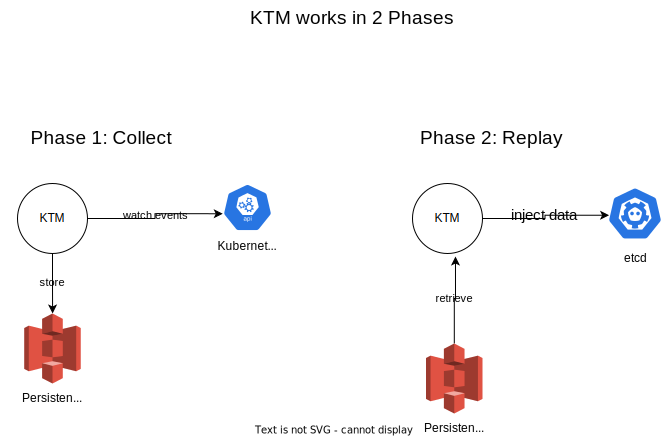

# Kubernetes Time Machine (KTM)

Welcome to KTM, this project aims to allow Devs and AI models replay an entire kubernetes cluster.

## This enables few possibilities:
- Machine learning models can be fed the same data over and over again for training.
- Devs/Engineers can replay an incident and interact with the cluster (from the past) in real-time to debug issues.
- and some cool unthought-of implementations.

## Lots of technicall challenges exist to achieve this.

Some that I can think of:
- How do we 'fool' an etcd cluster that it's interacting with real apiserver? (in order to feed past data, rather than realtime data)
- How do we collect data detailed enough to reproduce every single api request and interaction that happened in the cluster?

## Architecture

High level architecture that makes sense at the moment:

